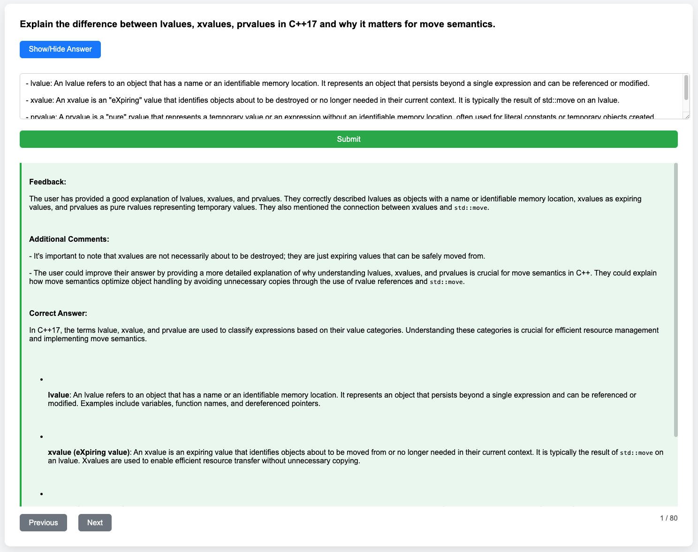

# C++ Flashcards Web App

A web-based flashcard app for practicing C++ interview questions, with AI-generated feedback from OpenAI.
Could easily be modified for other programming languages, by changing the prompts in `app.py`. You'd have to supply your own questions in `flashcards.json`.



## Features

- Display randomized C++ questions.
- Toggle answers on/off.
- Submit your answer and receive **constructive feedback** including correct explanations.
- Navigate through questions (Previous / Next).
- Logs all answers and AI feedback per session.
- Scrollable feedback for long answers.

## Requirements

- Python 3.10+
- `Flask`
- `openai`
- `python-dotenv`
- `markdown`
- `bleach`
- `markupsafe`

Install dependencies with:

```bash
pip install -r requirements.txt
```

## Setup

1. Clone the repository.
2. Create a `.env` file with your OpenAI API key:

```env
OPENAI_API_KEY=your_openai_api_key
FLASK_SECRET=your_secret_key
```

3. Run the app:

```bash
python app.py
```

4. Open `http://127.0.0.1:5000` in your browser.

## Usage

- Type your answer in the textarea.
- Click **Submit** to receive AI feedback.
- Use **Previous / Next** buttons to navigate.
- Feedback and answers persist during the session and are logged in JSON files under the `runs/` folder.

## Notes

- Feedback may include code examples and explanations.
- Flashcards are stored in `flashcards.json`.
